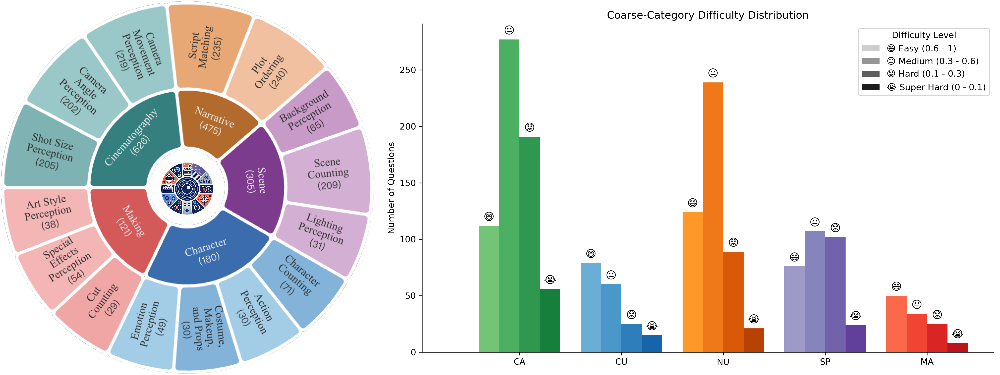
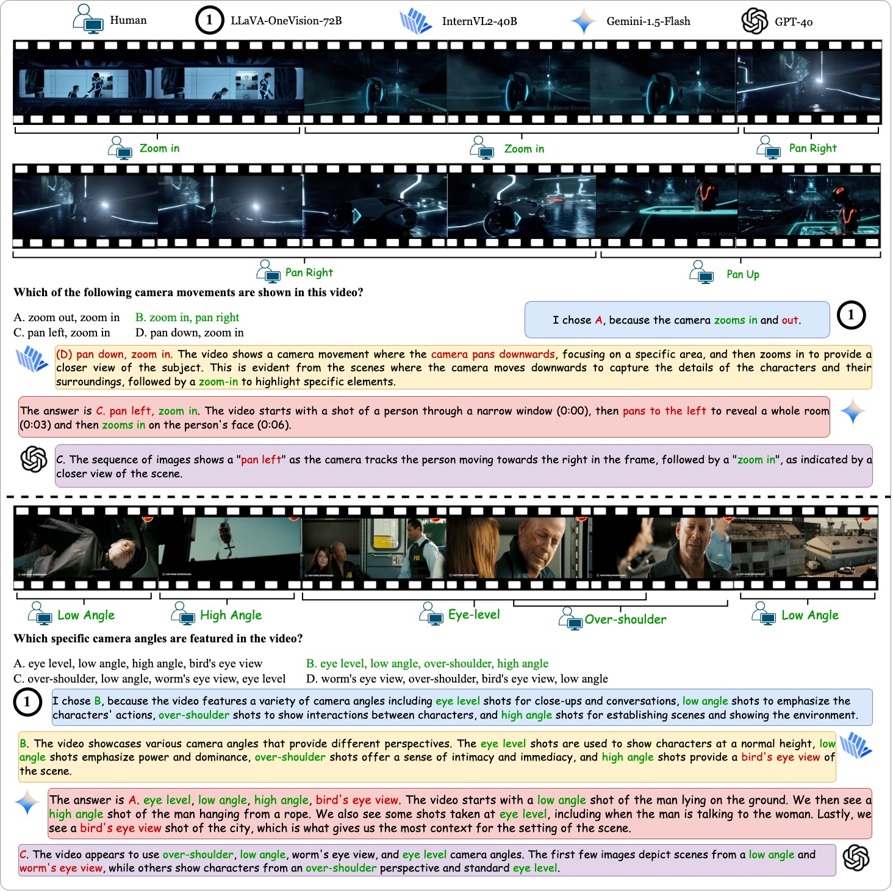

# ✨ VidComposition: Can MLLMs Analyze Compositions in Compiled Videos?
[**🌐 Homepage**](https://yunlong10.github.io/VidComposition/) | [**🔬 Paper**](https://yunlong10.github.io/VidComposition/) | [**👩‍💻 Code**](https://github.com/yunlong10/VidComposition/blob/main/) | [**📊 Dataset**](https://yunlong10.github.io/VidComposition/) | [**📈 Evaluation**](https://yunlong10.github.io/VidComposition/) | [**🏆 Leaderboard**](https://yunlong10.github.io/VidComposition/#leaderboard)

## What is VidComposition?
> VidComposition is a novel benchmark crafted to evaluate the fine-grained video composition understanding of Multimodal Large Language Models (MLLMs). It focuses on assessing the ability of these models to interpret and analyze complex video compositions, where visual elements interact dynamically across time and space. VidComposition aims to bridge the gap in evaluating MLLMs by providing a detailed framework for understanding video content at a cinematic level. It comprises 15 intricate video comprehension tasks across five key areas of video composition.


VidComposition enables researchers and practitioners to uncover the strengths, limitations, and potential areas for improvement in MLLMs, offering valuable insights into the challenges of understanding edited and compiled video content.


## 🏆 Leaderboard


[Link](https://yunlong10.github.io/VidComposition/#leaderboard)

## 📉 Statistics



[Link](https://yunlong10.github.io/VidComposition/#benchmark)

## 👀 Visualization Results




## ✏️ Citation
```bibtex
@article{tang2024vidcompostion,
  title = {VidComposition: Can MLLMs Analyze Compositions in Compiled Videos?},
  author = {Tang, Yunlong and Guo, Junjia and Hua, Hang and Liang, Susan and Feng, Mingqian and Li, Xinyang and Mao, Rui and Huang, Chao and Bi, Jing and Zhang, Zeliang and Fazli, Pooyan and Xu, Chenliang},
  journal = {arXiv preprint arXiv:2411.10979},
  year = {2024}
}
```
