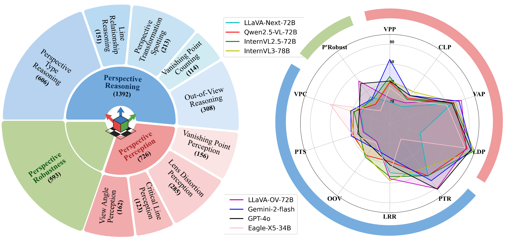

# ✨ MMPerspective: Do MLLMs Understand Perspective? A Comprehensive Benchmark for Perspective Perception, Reasoning, and Robustness
[**🌐 Homepage**](https://yunlong10.github.io/MMPerspective/) | [**🔬 Paper**](https://arxiv.org/abs/2411.10979) | [**👩‍💻 Code**](https://github.com/yunlong10/MMPerspective/blob/main/) | [**📊 Dataset**]() | [**📈 Evaluation**]() | [**🏆 Leaderboard**](https://yunlong10.github.io/MMPerspective/#leaderboard)

## What is MMPerspective?
> MMPerspective is a comprehensive benchmark designed to systematically evaluate the understanding of perspective geometry by Multimodal Large Language Models (MLLMs). It comprises 10 diverse tasks across three key dimensions: Perspective Perception, Reasoning, and Robustness, with 2,711 real-world and synthetic image instances.


MMPerspective enables researchers and practitioners to uncover the strengths, limitations, and potential areas for improvement in MLLMs, offering valuable insights into the challenges of understanding perspective geometry.


## 🏆 Leaderboard

<!--  -->

[Link](https://yunlong10.github.io/MMPerspective/#leaderboard)

## 📉 Statistics



[Link](https://yunlong10.github.io/MMPerspective/#benchmark)

## Data Curation Pipeline


## 👀 Visualization Results


## ✏️ Citation
```bibtex
@article{tang2025mmperspective,
  title = {MMPerspective: Do MLLMs Understand Perspective? A Comprehensive Benchmark for Perspective Perception, Reasoning, and Robustness},
  author = {Tang, Yunlong and Liu, Pinxin and Feng, Mingqian and Tan, Zhangyun and Mao, Rui and Huang, Chao and Bi, Jing and Xiao, Yunzhong and Liang, Susan and Hua, Hang and Vosoughi, Ali and Song, Luchuan and Zhang, Zeliang and Xu, Chenliang},
  journal = {},
  year = {2025}
}
```
